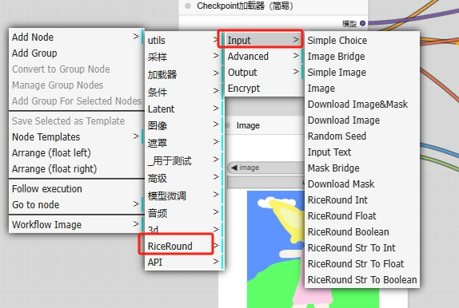
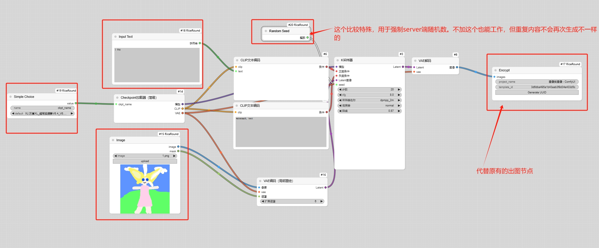
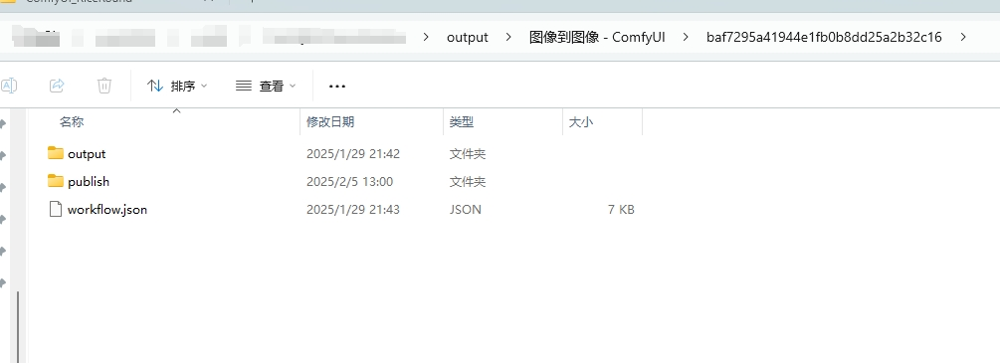

# ComfyUI_RiceRound

一键部署，同时成在线页面和comfyui云端节点。

 ## 快速启动：

 1、安装节点，git拉取也行，zip下载后解压到custom_nodes文件夹也行，然后重启comfyui。

 2、搭建工作流，注意用riceround里面的input节点！！output菜单里的节点不要用！！
 

 3、在尾部加上EncryptNode，然后点击运行
 

 4、会在output文件夹生成一些加密工作流文件，其中workflow.json就是你拿去发布的加密工作流。
 

 5、同时可以在https://www.riceround.online/ 可以管理你的工作流，也可以看见工作流生成的页面了。
 
  

 ## 持续在更新，有时候教程、演示文件没有来得及更新，请联系我微信。

